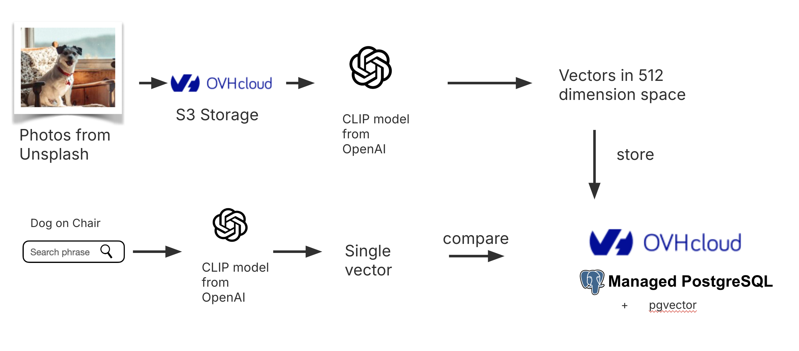

# Image Search Application with OVHcloud Managed Databases and OpenAI CLIP

## Introduction

Welcome to the Image Search Application! This project demonstrates how to leverage [OVHcloud's Managed PostgreSQL Databases](https://www.ovhcloud.com/en/public-cloud/postgresql/) alongside [OpenAI's CLIP model](https://github.com/openai/clip) to create an image search application.



## System Architecture

The architecture consists of several key components:

- **OVHcloud Managed PostgreSQL Database**: Stores image embeddings.
- **OVHcloud Object Storage**: Holds the actual images. (Provided For You)
- **OVHcloud Compute Instances**: Hosts the application, utilizing the powerful OpenAI CLIP model for processing.

## Scripts Breakdown

- **create_table.py**: Prepares the PostgreSQL database by enabling necessary extensions and creating tables if they do not exist.
- **process_images.py**: Fetches images from OVHcloud Object Storage, computes their embeddings using the CLIP model, and stores them in the database.
- **find_images.py**: Generates an embedding from user input text and queries the database for matches, making the application interactive.
- **app.py**: Offers a user-friendly interface where users can enter search queries and view results seamlessly.

## Running the Demo

> **Note** First two steps are for creating OVHcloud compute instance & Managed PostgreSQL Database. You can skip these steps if you already have these services available. You can also run this application locally on your system.

1. Create PostgreSQL database from OVHcloud control panel. [Follow the database creation guide](https://support.us.ovhcloud.com/hc/en-us/articles/20611621210515-Getting-Started-with-Cloud-Databases) and [PostgreSQL configuration guide](https://support.us.ovhcloud.com/hc/en-us/articles/21535313272083-PostgreSQL-Configure-an-Instance-to-Accept-Incoming-Connections)

2. Create OVHcloud public cloud compute instance (e.g. b3-8 located in Virginia with Ubuntu 24.04 image) connected to the public network. Here are some useful documentations: [Guide - compute instance creation](https://support.us.ovhcloud.com/hc/en-us/articles/360002245164-Creating-and-Connecting-a-Public-Cloud-Instance) and [Guide - SSH key creation](https://support.us.ovhcloud.com/hc/en-us/articles/33773177952659-Create-and-use-SSH-keys-for-Public-Cloud-instances)

   > **Note** Note down the IP address of the instance. You will need it for adding to the list of authorized IPs for the database.

3. Save the PostgreSQL URI from OVHcloud control panel with the correct username and password. We will use this URI to connect with the Database in scripts.

   > **Note** There will already be a default user that you can find under the Users tab of database details. You can reset password of the user by clicling on the three dots. Embed the username and password in your URI and note it down. We will need it to connect with the database.

4. From OVHcloud control panel, add IP address of the compute instance obtained from step 2 to "Authorised IPs" for PostgreSQL database.

5. Connect to the compute instance via ssh and check if python is installed (install python if not installed)

```shell
sudo apt update && sudo apt install python3 -y && sudo apt install python3-venv -y
```

6. Clone the Github repository containing these scripts to compute instance. cd to the directory containing scripts.

```shell
git clone https://github.com/pisymbol314/postgresql-clip.git && cd postgresql-clip
```

7. Create a virtual environment to keep package installation local to this directory

```shell
python3 -m venv venv
```

8. Enable virtual environment.

```shell
source venv/bin/activate
```

9. Install Python packages we need

```shell
TMPDIR=/home/ubuntu python3 -m pip install -r requirements.txt --no-cache-dir
```

> Note: Change TMPDIR to a different directory with enough size if you are using any other OS.

> **Note** Sometimes we've seen the Python `clip.load` function fail to download the CLIP model, presumably due to the source server being busy. The code here will use a local copy of the model if it's available. To make that local copy:

```shell
mkdir models

curl <https://openaipublic.azureedge.net/clip/models/40d365715913c9da98579312b702a82c18be219cc2a73407c4526f58eba950af/ViT-B-32.pt> --output models/ViT-B-32.pt
```

10. Copy the template environent file, and then edit the `.env` file to insert the credentials (URI) needed to connect to the database. You will also need to enter the S3 object storage access key and secret.
    > **Note** Inserting the database credentials, object storage access key and secret are **mendatory** for this demo. Database credentils (URI) were obtained from step 3 and need to be assigned to variable PG_SERVICE_URI. Object storage access key and secret will be shared during the demo session and will need to be assigned to variables S3_ACCESS_KEY and S3_SECRET_KEY respecively.

```shell
cp .env_example .env
```

11. Enable pgvector and set up the table we need in the database

```shell
./01_create_table.py
```

12. Calculate the embeddings for the pictures in the OVHcloud object storage and upload them to the database

```shell
./02_process_images.py
```

13. You can run `find_images.py` to check that everything is working - it looks for images matching the text `man jumping` and reports their filenames

```shell
./03_find_images.py
```

14. Run the webapp and access remotely using uvicorn server

```shell
uvicorn app:app --host 0.0.0.0 --port 8000 --reload
```

Go to http://<COMPUTE_INSTANCE_IP>:8000 in a web browser and request a search.

> **Note** ip_address is the IP address of the compute instance running scripts.

> **Remember to delete services once done with the demo to avoid recurring charges.**

Possible ideas include:

- cat
- man jumping
- outer space

## The photos

The images in the object storage are the same as those used in [Workshop: Searching for images with vector search - OpenSearch and CLIP model](https://github.com/Aiven-Labs/workshop-multimodal-search-CLIP-OpenSearch).

They came from Unsplash and have been reduced in size to make them fit within
GitHub filesize limits for a repository.

## Inspirations

- The [Workshop: Searching for images with vector search - OpenSearch and CLIP
  model](https://github.com/Aiven-Labs/workshop-multimodal-search-CLIP-OpenSearch)
  which does (essentially) the same thing, but using OpenSearch and Jupyter
  notebooks.

- [Building a movie recommendation system with Tensorflow and
  PGVector](https://github.com/Aiven-Labs/pgvector-tensorflow-movie-recommendations-workshop)
  which searches text, and produces a web app using JavaScript
